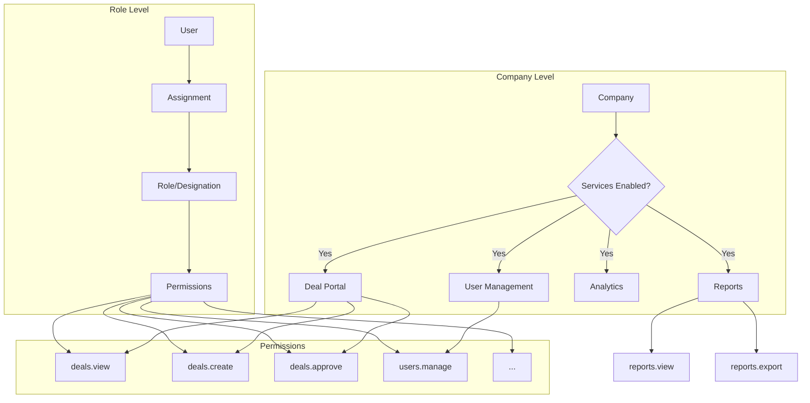

# Entity Relationship Diagram - Radian Platform

## Simplified Permissions Model

```mermaid
erDiagram
    %% ==================== COMPANIES ====================
    CompanyMaster {
        string companyId PK
        string companyName
        string companyType "RADIAN|MERCHANT|SUPPLIER|BROKER"
        string companyStatus
        boolean isClient
        string termsAndConditionsFile
        string trainingContentFile
        datetime createdAt
        datetime updatedAt
    }

    CompanyRelationship {
        string companyRelationshipId PK
        string fromCompanyId FK
        string toCompanyId FK
        string relationshipType "MERCHANT_SUPPLIER|BROKER_SUPPLIER|PARTNER"
        string relationshipStatus
        datetime createdAt
        datetime updatedAt
    }

    %% ==================== SERVICES ====================
    ServiceMaster {
        string serviceId PK
        string serviceKey UK "deal_portal|reports|analytics|user_management"
        string serviceName
        string serviceDescription
        string serviceStatus
        datetime createdAt
        datetime updatedAt
    }

    CompanyService {
        string companyServiceId PK
        string companyId FK
        string serviceId FK
        boolean isEnabled
        datetime createdAt
        datetime updatedAt
    }

    %% ==================== USERS ====================
    UserMaster {
        string userId PK
        string firstName
        string middleName
        string lastName
        string email UK
        string password
        string phone
        string status
        datetime createdAt
        datetime updatedAt
    }

    %% ==================== ROLES ====================
    DesignationMaster {
        string designationId PK
        string companyId FK
        string designationName
        string designationDescription
        string designationStatus
        datetime createdAt
        datetime updatedAt
    }

    UserCompanyAssignment {
        string userCompanyAssignmentId PK
        string userId FK
        string companyId FK
        string designationId FK
        string companyRelationshipId FK "nullable - scope"
        string assignmentStatus
        datetime createdAt
        datetime updatedAt
    }

    %% ==================== PERMISSIONS ====================
    PermissionMaster {
        string permissionId PK
        string permissionKey UK
        string permissionName
        string permissionDescription
        string permissionCategory "DEALS|REPORTS|USERS|SETTINGS|ADMIN"
        string permissionStatus
        datetime createdAt
        datetime updatedAt
    }

    DesignationPermission {
        string designationPermissionId PK
        string designationId FK
        string permissionId FK
        datetime createdAt
    }

    %% ==================== DEALS ====================
    DealType {
        string dealTypeId PK
        string dealTypeName
        string dealTypeDescription
        string dealTypeStatus
        datetime createdAt
        datetime updatedAt
    }

    DealPhase {
        string dealPhaseId PK
        string dealTypeId FK
        string phaseName
        int phaseOrder
        string phaseDescription
        string phaseStatus
        datetime createdAt
        datetime updatedAt
    }

    Deal {
        string dealId PK
        string dealNumber UK
        string dealTypeId FK
        string currentPhaseId FK
        string companyRelationshipId FK
        string ownerCompanyId FK
        string counterpartyCompanyId FK
        string dealTitle
        string dealDescription
        decimal dealAmount
        string dealCurrency
        datetime startDate
        datetime endDate
        string dealStatus
        json metadata
        string createdByUserId FK
        datetime createdAt
        datetime updatedAt
    }

    DealParticipant {
        string dealParticipantId PK
        string dealId FK
        string userId FK
        string companyId FK
        string participantRole "OWNER|APPROVER|VIEWER|COLLABORATOR"
        string participantStatus
        datetime addedAt
    }

    DealHistory {
        string dealHistoryId PK
        string dealId FK
        string actionType
        string previousPhaseId
        string newPhaseId
        string changedByUserId FK
        string changedByCompanyId FK
        string changeDescription
        json previousValue
        json newValue
        datetime createdAt
    }

    %% ==================== SUPPORTING ====================
    FileMaster {
        string fileId PK
        string fileName
        string originalFileName
        string contentType
        int fileSize
        string storageKey
        string storageUrl
        string entityType
        string entityId
        string uploadedByUserId FK
        string companyId FK
        string fileStatus
        datetime createdAt
        datetime updatedAt
    }

    AuditLog {
        string auditLogId PK
        string actorUserId FK
        string actorCompanyId FK
        string actionKey
        string actionCategory
        string entityType
        string entityId
        string entityName
        json previousValue
        json newValue
        json metadata
        string ipAddress
        string userAgent
        datetime createdAt
    }

    Invitation {
        string invitationId PK
        string email
        string token UK
        string invitedByUserId FK
        string companyId FK
        string designationId FK
        string companyRelationshipId FK
        datetime expiresAt
        datetime acceptedAt
        string invitationStatus
        datetime createdAt
        datetime updatedAt
    }

    %% ==================== RELATIONSHIPS ====================

    %% Company relationships
    CompanyMaster ||--o{ CompanyRelationship : "fromCompany"
    CompanyMaster ||--o{ CompanyRelationship : "toCompany"
    CompanyMaster ||--o{ CompanyService : "has services"
    CompanyMaster ||--o{ DesignationMaster : "has roles"
    CompanyMaster ||--o{ UserCompanyAssignment : "has users"
    CompanyMaster ||--o{ FileMaster : "owns files"
    CompanyMaster ||--o{ AuditLog : "audit logs"

    %% Service relationships
    ServiceMaster ||--o{ CompanyService : "enabled for"

    %% User relationships
    UserMaster ||--o{ UserCompanyAssignment : "assigned to"
    UserMaster ||--o{ FileMaster : "uploads"
    UserMaster ||--o{ AuditLog : "performs"

    %% Role/Permission relationships
    DesignationMaster ||--o{ UserCompanyAssignment : "assigned to users"
    DesignationMaster ||--o{ DesignationPermission : "has permissions"
    PermissionMaster ||--o{ DesignationPermission : "assigned to roles"

    %% Assignment scope
    CompanyRelationship ||--o{ UserCompanyAssignment : "scopes"

    %% Deal relationships
    DealType ||--o{ DealPhase : "has phases"
    DealType ||--o{ Deal : "categorizes"
    DealPhase ||--o{ Deal : "current phase"
    Deal ||--o{ DealParticipant : "has participants"
    Deal ||--o{ DealHistory : "has history"

    %% Invitation
    Invitation }o--|| CompanyMaster : "for company"
    Invitation }o--|| DesignationMaster : "with role"
```



## Access Control Flow



## Example: FreshThyme Category Manager

```mermaid
flowchart LR
    subgraph Company["FreshThyme (MERCHANT)"]
        S1[Deal Portal ✓]
        S2[Reports ✓]
        S3[Analytics ✓]
        S4[User Management ✓]
    end

    subgraph Role["Category Manager Role"]
        P1[deals.view ✓]
        P2[deals.create ✓]
        P3[deals.edit ✓]
        P4[deals.approve ✓]
        P5[deals.review ✓]
        P6[reports.view ✓]
        P7[reports.export ✓]
    end

    subgraph User["Sarah Johnson"]
        U1[sarah@freshthyme.com]
    end

    U1 -->|assigned| Role
    Role -->|in| Company
```

## Key Tables Summary

| Table | Purpose |
|-------|---------|
| `ServiceMaster` | Master list of available services/apps |
| `CompanyService` | Which services each company has enabled |
| `PermissionMaster` | Master list of all permissions |
| `DesignationMaster` | Roles defined per company |
| `DesignationPermission` | Permissions assigned to each role |
| `UserCompanyAssignment` | User → Company → Role assignment |
